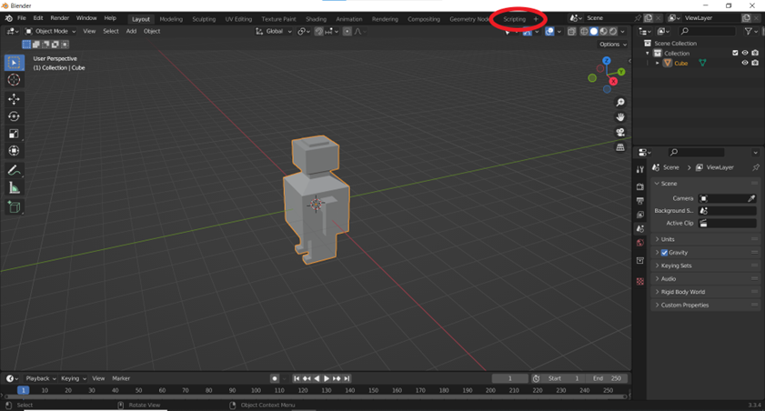

# Blender SDF-Exporter

## Exportscript

Für den Export von Blendermodellen gibt es ein eigenes Python-Script. Dieses kann man unter folgendem Link finden:

[sdf\_exporter.py](https://github.com/gazebosim/gz-sim/blob/ign-gazebo5/examples/scripts/blender/sdf_exporter.py)

Beim Öffnen von Blender muss das zu exportierende Modell geladen werden. Im Editor befindet sich am oberen Rand der Reiter „Scripting" in diesem wird das heruntergeladene Script geöffnet. Im sich öffnenden Fenster kann man den Speicherort auswählen.




Der entstandene Ordner kann in das eigene Projekt mit Hilfe des include-Tags eingebunden werden. Dieser wird in den world-Tag eingebunden.
```
<include>
	<uri>model://ModelSDF/model.sdf</uri>
	<pose>5 0 2.5 0 0 -1.5707</pose>
	<inertial>
	<mass>1.14395</mass>
		<inertia>
			<ixx>0.095329</ixx>
                <ixy>0</ixy>
                <ixz>0</ixz>
                <iyy>0.381317</iyy>
                <iyz>0</iyz>
                <izz>0.476646</izz>
		</inertia>
	</inertial>
</include>
```

## Fehlerbehebung des Scriptes

Das .dae-File wird im Subordner „meshes" abgelegt. Das SDF-File bezieht sich aber auf den übergeordneten Ordner, deshalb muss das Mesh in diesen kopiert werden.

Alle SDF-Modelle werden „test" genannt. Falls mehr als ein exportiertes Modell eingebunden wird, muss der Name angepasst werden.

Das Exportscript kann keinen 3D-Scan exportieren. Alle Meshes müssen aus echten 3D-Formen bestehen. Es dürfen keine allein stehenden Flächen im Modell sein.