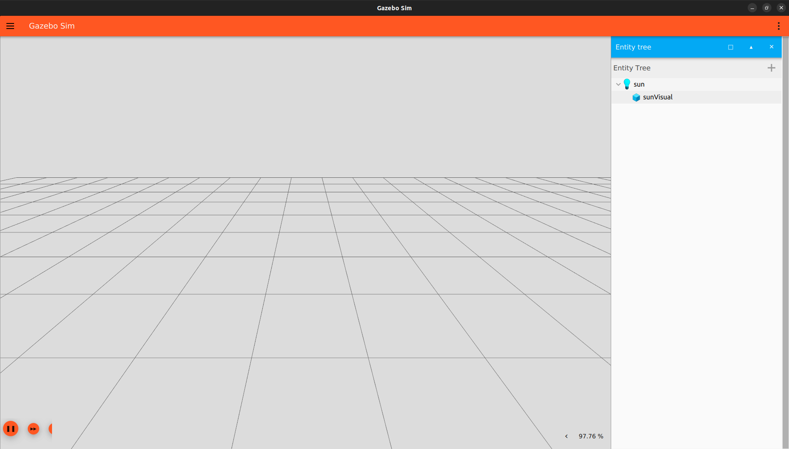

# Erstellen einer Welt

## SDFormat

Die Grundlage für jede Simulation in Gazebo ist die Welt. Diese definiert die Umgebung, die verwendeten Modelle und die Physik der Simulation. Alle diese Parameter werden in einer SDF-File abgelegt, dabei handelt es sich um eine XML-Format.

## Grundlagen einer SDF-Welt

Alle SDF-Welten starten gleich. Dazu wird eine neue File angelegt „project_world.sdf".
```
<?xml version="1.0" ?>
<sdf version="1.8">
    <world name="project_world">
    ...
    ...
    </world>
</sdf>
```

Im Tag XML und SDF werden die benötigten Versionen definiert. Alle Inhalte, die zur Welt gehören, in den world-Tag geschrieben.

## Physik
```
<physics name="1ms" type="ignored">
    <max_step_size>0.001</max_step_size>
    <real_time_factor>1.0</real_time_factor>
</physics>
```

Im physics-Tag werden die Eigenschaften der Engine definiert. Das type-Attribut definiert die verwendete Physikbibliothek. Es gibt mehrere Möglichkeiten:

- Ode
- Bullet
- Simbody
- Dart

In diesem Beispiel wird dieses Attribut auf ignored gesetzt. Im max_step_size-Tag wird das Zeitintervall angegeben, mit dem sich die Engine aktualisiert. Im real_time_factor-Tag wird das Verhältnis zwischen Echtzeit und Simulationszeit angegeben.

## Plugins

Alle Erweiterungen werden als Plugins in die Welt geladen.
```
<plugin
    filename="gz-sim-physics-system"
    name="gz::sim::systems::Physics">
</plugin>
```

Dieses Plugin stellt die Grundlage für die dynamische Berechnung der Welt bereit.
```
<plugin
    filename="gz-sim-user-commands-system"
    name="gz::sim::systems::UserCommands">
</plugin>
```

Dieses Plugin ermöglicht es dem Nutzer Modelle zu Erstellen und zu Verändern.
```
<plugin
    filename="gz-sim-scene-broadcaster-system"
    name="gz::sim::systems::SceneBroadcaster">
</plugin>
```

Dieses Plugin ist für die Anzeige der Welt verantwortlich.

## GUI

Alle Elemente der GUI werden im gui-Tag angelegt.

```
<gui fullscreen="0">
    ...
    ...
</gui>
```


Innerhalb der GUI gibt es mehrere Plugins, die häufig verwendet werden

```
<plugin filename="GzScene3D" name="3D View">
  	<gz-gui>
        <title>3D View</title>
        <property type="bool" key="showTitleBar">false</property>
        <property type="string" key="state">docked</property>
        </gz-gui>

        <engine>ogre2</engine>
        <scene>scene</scene>
        <ambient_light>0.4 0.4 0.4</ambient_light>
        <background_color>0.8 0.8 0.8</background_color>
</plugin>
```

Das GzScene3D-Plugin ist für das Anzeigen der Welt verantwortlich. Es kann um verschiedene Atribute erweitert werden, wie die verwendete Engine oder die Hintergrundfarbe.

```
<plugin filename="WorldControl" name="World control">
  	<gz-gui>
        <title>World control</title>
            <property type="bool" key="showTitleBar">false</property>
            <property type="bool" key="resizable">false</property>
            <property type="double" key="height">72</property>
            <property type="double" key="width">121</property>
            <property type="double" key="z">1</property>

            <property type="string" key="state">floating</property>
            <anchors target="3D View">
                <line own="left" target="left"/>
                <line own="bottom" target="bottom"/>
            </anchors>
      	</gz-gui>

       	<play_pause>true</play_pause>
        	<step>true</step>
        	<start_paused>true</start_paused>
       	<service>/world/car_world/control</service>
      	<stats_topic>/world/car_world/stats</stats_topic>
</plugin>
```

Das WorldControl-Plugin ist für Kontrolle der Simulation verantwortlich. Mit diesem lässt sich die Simulation starten, anhalten und zurücksetzen.

```
<plugin filename="WorldStats" name="World stats">
    <gz-gui>
        <title>World stats</title>
            <property type="bool" key="showTitleBar">false</property>
            <property type="bool" key="resizable">false</property>
        <property type="double" key="height">110</property>
            <property type="double" key="width">290</property>
            <property type="double" key="z">1</property>

            <property type="string" key="state">floating</property>
            <anchors target="3D View">
                <line own="right" target="right"/>
                <line own="bottom" target="bottom"/>
        </anchors>
    </gz-gui>

    <sim_time>true</sim_time>
  	<real_time>true</real_time>
    <real_time_factor>true</real_time_factor>
  	<iterations>true</iterations>
   	<topic>/world/car_world/stats</topic>
</plugin>

```

Das WorldStats-Plugin zeigt die Simulationsparameter an und veröffentlicht diese auf der topic /world/car_world/stats.

Zum starten der Welt wird folgender Befehl aufgerufen:

```
gz sim project_world.sdf
```

Nach drücken des Playbuttons startet die Simulation. Mit dem folgendem Befehl lassen sich alle aktiven Topics anzeigen.

```
gz topic -l
```

Innerhalb des gui-Tags können weitere Plugins hinzugefügt werden, wie zum Beispiel der EntityTree, dieser zeigt alle Elemente der Welt an.

```
<plugin filename="EntityTree" name="Entity tree">
</plugin>
```

Im aktuellen Zustand ist dieser noch leer, da weder Modelle noch Licht in der Welt vorhanden sind. Hier kann der gui-Tag geschlossen werden.

## Light

Es gibt drei Arten von Licht. Dazu gehören point, directional und spot.

```
<light type="directional" name="sun">
    <cast_shadows>true</cast_shadows>
    <pose>0 0 10 0 0 0</pose>
    <diffuse>0.8 0.8 0.8 1</diffuse>
    <specular>0.2 0.2 0.2 1</specular>
    <attenuation>
        <range>1000</range>
        <constant>0.9</constant>
        <linear>0.01</linear>
        <quadratic>0.001</quadratic>
    </attenuation>
    <direction>-0.5 0.1 -0.9</direction>
</light>
```


Das Licht kann genauer spezialisiert werden, so lässt sich das diffuse-light und specular-light einstellen. Bei dem directional-light muss außerdem die Richtung aus der das Licht kommt eingestellt werden.



Beim starteten der Welt, sollte jetzt ein neues Element im EntityTree vorhanden sein.


Eine Beispielwelt befindet sich unter folgendem Link:

[simple_world.sdf](../demo_worlds/simple_world.sdf)