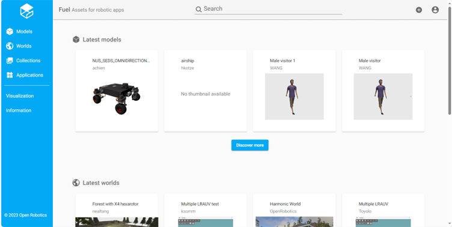

# Modelle

## Fuel

Fuel ist eine Sammlung an vorgefertigten kostenlosen SDF-Files zur Einbindung in eigene Prpjekte. Dabei kann es sich um Robotermodelle, Welten oder Wettermodelle handeln. Über den folgenden Link erreicht man Fuel:

[Fuel](https://app.gazebosim.org/fuel)



Die fertigen Modelle können auf zwei Arten in die eigene Welt integriert werde: über die Website
```
<include>
    <uri>https://fuel.gazebosim.org/1.0/OpenRobotics/models/Coke</uri>
</include>
```

oder über den Download der Files auf den lokalen Rechner. Die Bedingung ist hierbei, dass der heruntergeladene Orner im gleichen Verzeichnis liegt wie die SDF-File.
```
<include>
    <uri>model://Coke</uri>
</include>
```

## Eigenen Roboter erstellen

Jedes Modell beginnt mit dem model-Tag, wo alle Eigenschaften des Roboters enthalten sind.
```
<model name='vehicle_blue'>
    ...
    ...
</model>
```

In diesen Tag kann man Eigenschaften wie die Startposition und -orientation hinterlegen.

```
<pose relative_to='world'>0 0 0 0 0 0</pose>
```

Es ist ersichtlich, dass die Position in Relation zum Weltkoordinatensystem angegeben wird.

Ein Modell besteht immer aus Links, die durch Joints verbunden werden. Die Links sind dabei die 3D-Objekte und Joints Achsen und Gelenke, an denen sich die Objekte bewegen können.

Ein Link wird erzeugt wie folgt:
```
<link name='chassis'>
    <pose relative_to='__model__'>0.5 0 0.4 0 0 0</pose>
	...
	...
</link>
```

Jedem Link kann auch eine eigene Position innerhalb des Modells zugewiesen werden; diese ist relativ zum Modellursprung.

Mit dem inertial-Tag wird die Masse bestimmt und die Auswirkungen von Kräften werden auf das Modell abgebildet.
```
<inertial>
   	<mass>1.14395</mass>
    <inertia>
        <ixx>0.095329</ixx>
        <ixy>0</ixy>
        <ixz>0</ixz>
        <iyy>0.381317</iyy>
        <iyz>0</iyz>
        <izz>0.476646</izz>
   	</inertia>
</inertial>
```

Der visual-Tag definiert das Aussehen des Modells.
```
<visual name='visual'>
  	<geometry>
        <box>
            <size>2.0 1.0 0.5</size>
        </box>
    </geometry>
	<material>
        <ambient>0.0 0.0 1.0 1</ambient>
        <diffuse>0.0 0.0 1.0 1</diffuse>
        <specular>0.0 0.0 1.0 1</specular>
  	</material>
</visual>
```

Da das Kollisionsmodell in den meisten Fällen einfacher ist als das Originalmodell, gibt es den collision-Tag. Dies wird gemacht, weil die Kollisionsberechnung mit komplexen Modellen sehr aufwendig ist.
```
<collision name='collision'>
    <geometry>
        <box>
            <size>2.0 1.0 0.5</size>
        </box>
    </geometry>
</collision>
```

Danach kann der link-Tab geschlossen werden.

In der verlinkten XML-Datei ist ein Modell mit vier Links hinterlegt:

[ModellLinks.xml](../snippets/ModellLinks.xml)

In diesem Beispiel wird für das Caster-Rad ein Frame genutzt. Dieser beinhaltet eine Pose, auf die mehrere andere Links zugreifen können, was das Gruppieren von diesen vereinfacht.
```
<frame name="caster_frame" attached_to='chassis'>
    <pose>0.8 0 -0.2 0 0 0</pose>
</frame>
```

Der zweite Hauptbaustein, aus dem ein Roboter besteht, sind Joints. Diese halten die Links zusammen und bestimmen die Freiheitsgrade zwischen ihnen.
```
<joint name='left_wheel_joint' type='revolute'>
    <pose relative_to='left_wheel'/>
    <parent>chassis</parent>
    <child>left_wheel</child>
    <axis>
        <xyz expressed_in='__model__'>0 1 0</xyz>
        <limit>
            <lower>-1.79769e+308</lower>
            <upper>1.79769e+308</upper>    
        </limit>
    </axis>
</joint>
```

Wichtige Elemente des Joints sind der parent- und child-Tag. Ein Link kann mehrere Children haben, aber nur einen Parent. Dadurch entsteht eine Baumstruktur mit einem Link als Wurzel. Im axis-Tag wird angegeben, um welche Achsen sich der Link bewegen kann. Wenn dieser Tag weggelassen wird, kann sich der Link in alle Richtung drehen.

Im Folgenden wurde das Robotermodell um die zugehörigen Joints ergänzt:

[ModellLinksJoints.xml](../snippets/ModellLinksJoints.xml)
