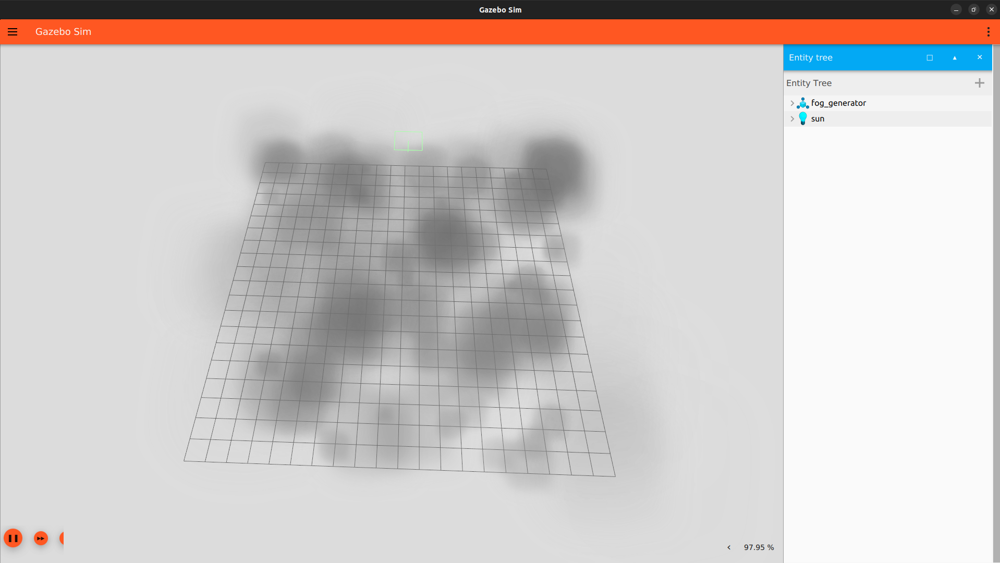

# Partikelemitter

## SDF-File Anpassung

Bei einem Partikelemitter handelt es sich um ein Plugin. Dieses kann unter dem world-Tag hinzugefügt werden.

```
<plugin filename="libgz-sim-particle-emitter-system" name="gz::sim::systems::ParticleEmitter">
</plugin>
```
 
Mit diesem Befehl ist die Bibliothek eingebunden. Im nächsten Schritt muss ein neues Modell angelegt werden, welches den Partikelemitter beinhaltet.

```
<model name="fog_generator">
   	<pose>0 0 0 0 -1.5707 0</pose>
    <static>true</static>
    <link name="fog_link">
        <particle_emitter name="emitter" type="box">
            <emitting>true</emitting>
            <size>20 20 0</size>
            <particle_size>1 1 1</particle_size>
            <lifetime>25</lifetime>
            <min_velocity>0.1</min_velocity>
            <max_velocity>0.2</max_velocity>
            <scale_rate>0.5</scale_rate>
            <rate>5</rate>
            <material>
                <diffuse>0.7 0.7 0.7</diffuse>
                <specular>1.0 1.0 1.0</specular>
                <pbr>
                    <metal>
                        <albedo_map>materials/textures/fog.png</albedo_map>
                    </metal>
                </pbr>
            </material>                 
            <color_range_image>materials/textures/fogcolors.png</color_range_image>
        </particle_emitter>
    </link>
</model>
```

Bei dem Nebelgenerator, handelt es um ein Modell von Fuel:

[Fog Generator](https://app.gazebosim.org/OpenRobotics/fuel/models/Fog%20Generator)

Dem Partikelemitter werden Informationen zur Aussehen der Partikel, der Größe des Emitterbereichs und die Geschwindigkeit der Partikel übergeben.



Eine Beispielwelt mit dem Partikelemitter liegt unter folgendem Link:

[particle\_emitter\_world.sdf](../demo_worlds/particle_emitter_world.sdf)

## Nutzung des Partikelemitters

Zum steuern des Partikelemitters verfügt dieser über eine Topic, dafür muss die Simulation in Gazebo gestartet werden. Mit dieser kann die Emittierungsgeschwindigkeit und der Aktivzustand des Nebelgenerators beeinflusst werden.
```
gz topic -t /model/fog\_generator/link/fog\_link/particle\_emitter/emitter/cmd -m gz.msgs.ParticleEmitter -p 'emitting: {data: true}'
```

Mit diesem Befehl wird der Emitter an- oder abgeschaltet. Im data-Feld kann entweder true oder false angegeben werden. Bei true startet der Partikelemitter, bei false stoppt er. Die Partikel, die bereits emittiert wurden, bleiben bestehen.
```
gz topic -t /model/fog\_generator/link/fog\_link/particle\_emitter/emitter/cmd -m gz.msgs.ParticleEmitter -p 'rate: {data: 100}'
```

Dieser Befehl steuert die Rate, mit der Partikel emittiert werden. Im data-Feld wird eine Zahl zwischen 0 und 100 eingegeben, diese steht für den Prozentsatz mit dem Partikel emittiert werden.