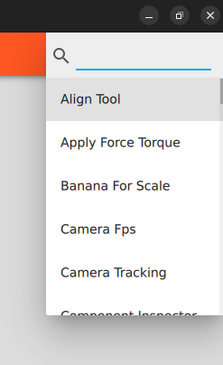
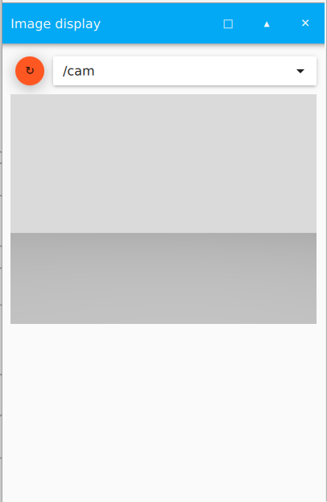
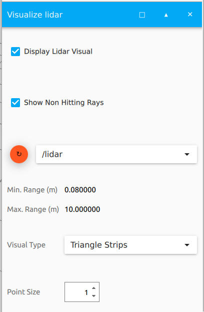
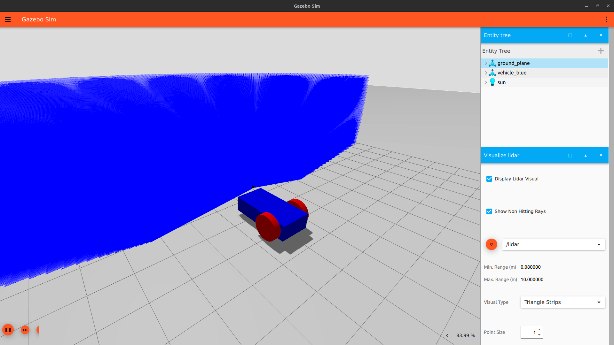

# Sensoren

## Anpassung der SDF-File

Die Sensor Bibliothek wird über ein Plugin in die Welt eingefügt.
```
<plugin 
	filename="libgz-sim-sensors-system" 
	name="gz::sim::systems::Sensors">
 	<render_engine>ogre2</render_engine>
</plugin>
```

Im Anschluss muss der Sensor dem Roboter hinzugefügt werden. Dazu wird das moving\_roboter.sdf verwendet([moving\_roboter.sdf](../demo_worlds/moving_roboter.sdf) ). Die Anpassungen der File werden im model-Tag des vehicle\_blue definiert.

```
<frame name="sensor_frame" attached_to="chassis">
  	<pose>0.8 0 0.5 0 0 0</pose>
</frame>
```

Der Frame beinhaltet die Position des Sensors relativ zum Link „chassis".

## LiDAR-Sensor

Unter dem link-Tag „chassis" wird der Sensor hinzugefügt.

```
<sensor name='gpu_lidar' type='gpu_lidar'>
	<pose relative_to='sensor_frame'>0 0 0 0 0 0</pose>
    <topic>lidar</topic>
    <update_rate>10</update_rate>
    <ray>
        <scan>
            <horizontal>
                <samples>640</samples>
                <resolution>1</resolution>
                <min_angle>-1.396263</min_angle>
                <max_angle>1.396263</max_angle>
            </horizontal>
            <vertical>
                <samples>64</samples>
                <resolution>1</resolution>
                <min_angle>-0.261799</min_angle>
                <max_angle>0.3</max_angle>
            </vertical>
        </scan>
        <range>
            <min>0.08</min>
            <max>10.0</max>
            <resolution>0.01</resolution>
        </range>
    </ray>
    <always_on>1</always_on>
    <visualize>true</visualize>
</sensor>

```

Dem Sensor werden Eigenschaften zum Sichtfeld, Reichweite und dem Aktivstatus übergeben und auf der Topic „lidar" veröffentlicht.

## Kamera

Unter dem link-Tag „chassis" wird der Sensor hinzugefügt.
```
<sensor name="camera" type="camera">
	<pose relative_to='sensor_frame'>0 0 0 0 0 0</pose>
	<topic>cam</topic>
    <camera>
        <horizontal_fov>1.047</horizontal_fov>
  		<image>
            <width>800</width>
            <height>600</height>
        </image>
        <clip>
            <near>0.1</near>
            <far>10</far>
        </clip>
   	</camera>
   	<always_on>1</always_on>
   	<update_rate>30</update_rate>
    <visualize>true</visualize>
</sensor>
```

Die Kamera hat einen ähnlichen Aufbau wie der LiDAR-Sensor. Zusätzlich wird statt dem ray-Tag der camera-Tag verwendet. In diesem werden Informationen zum Sichtfeld der Kamera und Auflösung des Bildes abgespeichert.

## Verwendung der Sensoren

Eine Beispielwelt mit den Sensoren ist unter folgendem Link zu finden:

[moving\_roboter\_sensors.sdf](../demo_worlds/moving_roboter_sensors.sdf)

Zu Beginn wird die Simulation gestartet.
```
gz sim moving\_roboter\_sensors.sdf
```

Wenn die Simulation läuft, erscheinen zusätzliche Gazebo-Topics.
```
gz topic -l
```

- /lidar: LaserScan des LiDAR-Sensor
- /lidar/points: PointCloud des LiDAR-Sensor
- /cam: Kamerabild

Im Simulationsfenster kann über die drei Punkte in der oberen rechten Ecke neue GUI-Plugins hinzugefügt werden. Darüber kann man „Visualize Lidar" und „Show Image" auswählen. Diese visualisieren die Sensordaten in der Simulationsumgebung.



Image display Plugin:



Visualize lidar Plugin:





